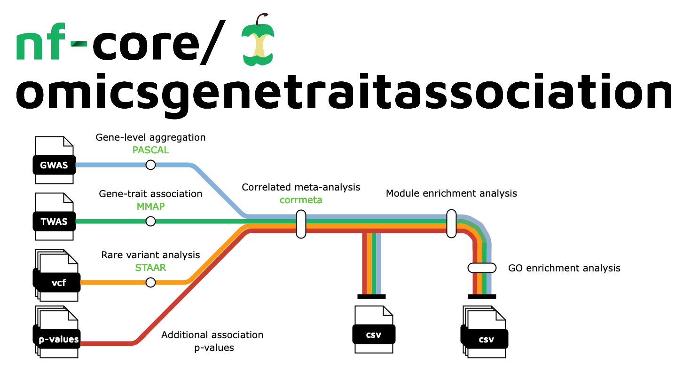

<h1>
  <picture>
    <source media="(prefers-color-scheme: dark)" srcset="docs/images/nf-core-omicsgenetraitassociation_logo_dark.png">
    
  </picture>
</h1>
[](https://github.com/nf-core/omicsgenetraitassociation/actions?query=workflow%3A%22nf-core+CI%22)
[](https://github.com/nf-core/omicsgenetraitassociation/actions?query=workflow%3A%22nf-core+linting%22)[](https://nf-co.re/omicsgenetraitassociation/results)[](https://doi.org/10.5281/zenodo.XXXXXXX)

[](https://www.nextflow.io/)
[](https://docs.conda.io/en/latest/)
[](https://www.docker.com/)
[](https://sylabs.io/docs/)
[](https://tower.nf/launch?pipeline=https://github.com/nf-core/omicsgenetraitassociation)

[](https://nfcore.slack.com/channels/omicsgenetraitassociation)[](https://twitter.com/nf_core)[](https://mstdn.science/@nf_core)[](https://www.youtube.com/c/nf-core)

## Introduction

**nf-core/omicsgenetraitassociation** is a bioinformatics pipeline that can be used to perform meta-analysis of trait associations accounting for correlations across omics studies due to hidden non-independencies between study elements which may arise from overlapping or related samples. It takes a samplesheet with input omic association data, performs gene-level aggregation, correlated meta-analysis, and produces a report on downstream module enrichment and gene ontology enrichment analyses.



1. Gene-level aggregation of GWAS summary statistics [`PASCAL`](https://github.com/BergmannLab/PascalX)
2. Gene-trait association [`MMAP`](https://mmap.github.io/)
3. Correlated meta-analysis [`corrmeta`](https://github.com/wsjung/corrmeta) <!-- update link when on bioconductor -->
4. Module enrichment analysis [`MEA`](https://github.com/BergmannLab/PascalX)
5. Gene ontology (GO) enrichment analysis [`GO`](https://cran.r-project.org/web/packages/WebGestaltR/index.html)

## Usage

> [!NOTE]
> If you are new to Nextflow and nf-core, please refer to [this page](https://nf-co.re/docs/usage/installation) on how to set-up Nextflow. Make sure to [test your setup](https://nf-co.re/docs/usage/introduction#how-to-run-a-pipeline) with `-profile test` before running the workflow on actual data.

First, prepare a samplesheet with your input data that looks as follows:

`samplesheet.csv`:

```csv title="samplesheet.csv"
sample,trait,pascal,twas,additional_sources
llfs_fhshdl,fhshdl,data/llfs/fhshdl/gwas.csv,data/llfs/fhshdl/twas.csv,data/llfs/additional_sources.txt
fhs_lnTG,lnTG,data/fhs/lnTG/gwas.csv,data/fhs/lnTG/twas.csv,
```

Each row represents a single correlated meta-analysis run. `pascal` is the GWAS summary statistics to be aggreagted to the gene-level. `twas` is the gene-trait association phenotype file (please refer to [usage.md](docs/usage.md) for details). `additional_sources` lists paths to additional omic association p-values.

Now, you can run the pipeline using:

```bash
nextflow run nf-core/omicsgenetraitassociation \
  -profile <docker/singularity/.../institute> \
  --input samplesheet.csv \
  --outdir <OUTDIR>
```

> [!WARNING]
> Please provide pipeline parameters via the CLI or Nextflow `-params-file` option. Custom config files including those provided by the `-c` Nextflow option can be used to provide any configuration _**except for parameters**_;
> see [docs](https://nf-co.re/usage/configuration#custom-configuration-files).

For more details and further functionality, please refer to the [usage documentation](https://nf-co.re/omicsgenetraitassociation/usage) and the [parameter documentation](https://nf-co.re/omicsgenetraitassociation/parameters).

## Pipeline output

To see the results of an example test run with a full size dataset refer to the [results](https://nf-co.re/omicsgenetraitassociation/results) tab on the nf-core website pipeline page.
For more details about the output files and reports, please refer to the
[output documentation](https://nf-co.re/omicsgenetraitassociation/output).

## Credits

nf-core/omicsgenetraitassociation was originally written by Woo Jung ([@wsjung](https://github.com/wsjung)). <!-- TODO wsjung: include DOI to CMA paper when published -->

Many thanks to others who have written parts of the pipeline or helped out along the way too, including (but not limited to):

-   [Chase Mateusiak](https://github.com/cmatKhan)
-   [Sandeep Acharya](https://github.com/sandeepacharya464)
-   [Edward Kang](https://github.com/edwardkang0925)
-   Lisa Liao
-   Michael Brent
-   Michael Province

## Contributions and Support

If you would like to contribute to this pipeline, please see the [contributing guidelines](.github/CONTRIBUTING.md).

For further information or help, don't hesitate to get in touch on the [Slack `#omicsgenetraitassociation` channel](https://nfcore.slack.com/channels/omicsgenetraitassociation) (you can join with [this invite](https://nf-co.re/join/slack)).

## Citations

<!-- TODO nf-core: Add citation for pipeline after first release. Uncomment lines below and update Zenodo doi and badge at the top of this file. -->
<!-- If you use nf-core/omicsgenetraitassociation for your analysis, please cite it using the following doi: [10.5281/zenodo.XXXXXX](https://doi.org/10.5281/zenodo.XXXXXX) -->

An extensive list of references for the tools used by the pipeline can be found in the [`CITATIONS.md`](CITATIONS.md) file.

You can cite the `nf-core` publication as follows:

> **The nf-core framework for community-curated bioinformatics pipelines.**
>
> Philip Ewels, Alexander Peltzer, Sven Fillinger, Harshil Patel, Johannes Alneberg, Andreas Wilm, Maxime Ulysse Garcia, Paolo Di Tommaso & Sven Nahnsen.
>
> _Nat Biotechnol._ 2020 Feb 13. doi: [10.1038/s41587-020-0439-x](https://dx.doi.org/10.1038/s41587-020-0439-x).
